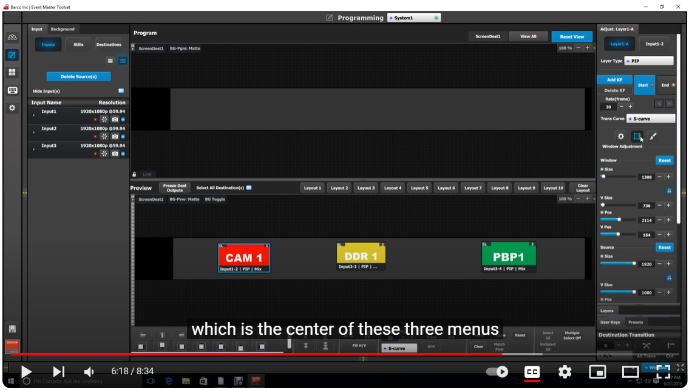

Barco Event Master switchers are built for the rental industry to provide high quality superior image quality, exceptional input and output density, great expandability and durability.

We created the user interface to control the FPGA driven video processor in real time to provide an exceptional show experience.
